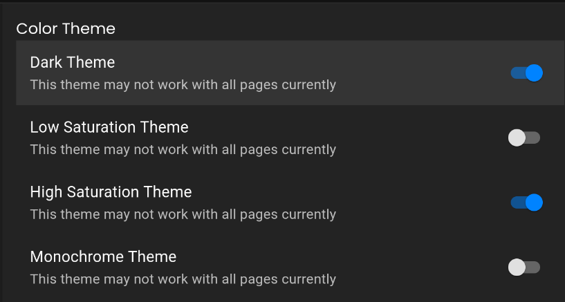
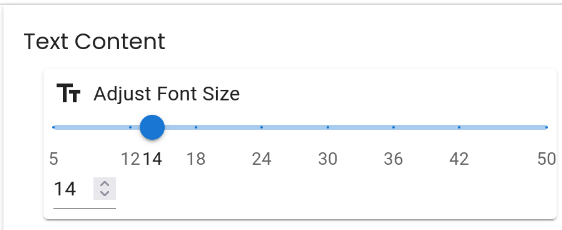

# Individual Weekly Report

**Name**: Donato Curvino

**Team**: Chem Caf3

**Date**: 4/7/25

## Current Status

### What did _you_ work on this past week?

| Task | Status | Time Spent | 
| ---- | ------ | ---------- |
| added different color themes for accessibility | done | 2 |
| changed font size controls to a slider | done | 1 |

*Include screenshots/diagrams/figures/etc. to illustrate what you did this past week.*

### What problems did you run into? What is your plan for them?
I ran into problems with events in React. Robbie helped me figure out that I needed to use the `onBlur` prop

### What is the current overall project status from your perspective? 
Almost there, but the backend has not made much progress recently

### How is your team functioning from your perspective?
Some communication issues; one team member has been unresponsive

### What new ideas did you have or skills did you develop this week?
I learned how to use MaterialUI Themes

### Who was your most awesome team member this week and why?
Robbie helped me with React and MaterialUI

## Plans for Next Week

*What are you going to work on this week?*

Finish any more settings and practice for the Capstone Expo

