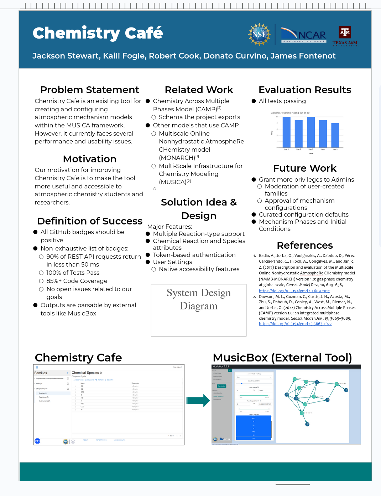

# Individual Weekly Report

**Name**:
James Fontenot

**Team**: 
Chem-Caf3

**Date**: 
April 14, 2025

## Current Status

### What did _you_ work on this past week?

| Task                                         | Status    | Time Spent | 
| -------------------------------------------- | --------- | ---------- |
|Worked on EPS Poster                          |Complete   |60 min.     |

*Include screenshots/diagrams/figures/etc. to illustrate what you did this past week.*

### What problems did you run into? What is your plan for them?
The team needs to stop turning projects minute before they due.
This can be solved by reminding team members of assignments and start working on them earlier.

### What is the current overall project status from your perspective? 
The project is bit behind the back-end but the front-end is progressing nicely.

### How is your team functioning from your perspective?
We do not know what one of our team members is doing, 
but otherwise the team is functioning fine.

### What new ideas did you have or skills did you develop this week?
I learned how to create bar graphs and histograms in Google Spreadsheets.

### Who was your most awesome team member this week and why?
Robbie, because he did most of the poster revision.

## Plans for Next Week

*What are you going to work on this week?*

I will add increase coverage in the back-end.
