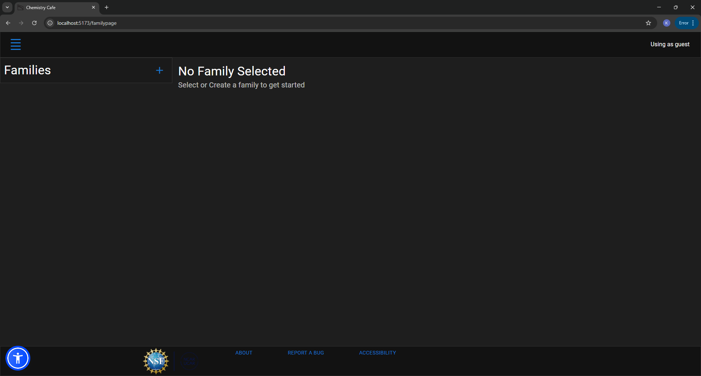

# Individual Weekly Report

**Name**: Kaili M. Fogle

**Team**: ChemCaf3

**Date**: 04.14.25

## Current Status

### What did _you_ work on this past week?

| Task | Status | Time Spent | 
| ---- | ------ | ---------- |
| Finding Frontend Bugs | In Progress | 1 hour |

*Include screenshots/diagrams/figures/etc. to illustrate what you did this past week.*

Not much really happened this week. I participated in the group meeting with Kyle and continued to try and break the family editor whenever I was bored. So far, new features on the main branch seem to work just fine, so I found nothing to report.

### What problems did you run into? What is your plan for them?
I did not run into any problems relating to the project. My other classes are trying to kill me, though.

### What is the current overall project status from your perspective? 
The overall project seems to be mostly functional. Team members have significantly improved testing and code coverage, which is nice. Everyone is waiting on Jackson to finish his end of things. Since he isn't done, we're also fairly behind on user studies than we would like to be. For reasons, the backend needs to be done and good to go before we conduct our user studies with the folks at NCAR.

### How is your team functioning from your perspective?
The team is mostly functional. Once again, we're all just kinda waiting on Jackson, hopefully he delivers.

### What new ideas did you have or skills did you develop this week?
I didn't develop anything new in particular this week.

### Who was your most awesome team member this week and why?
Robbie is cool, but I'll switch it up and say Donato this time. He's pretty relaxed and great to work with. I find his work on accessibility to bring great improvements to our application, and it gives me more things to mess around with when looking for bugs or improvements that could be made to the frontend.

## Plans for Next Week
*What are you going to work on this week?*
This week, I will work on everything that I said I would once Jackson completes his side. I'll get the final version (well, mostly final, since the user studies aren't gonna make it in time) of the expo poster done. I'll continue to look for any issues. If my team needs anything relating to CI/CD then I'll be ready to take on those tasks. Lastly, it's probably not something important, but I will look into if our project can upgrade from .net 8.0 to 9.0.