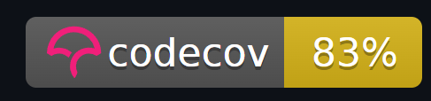
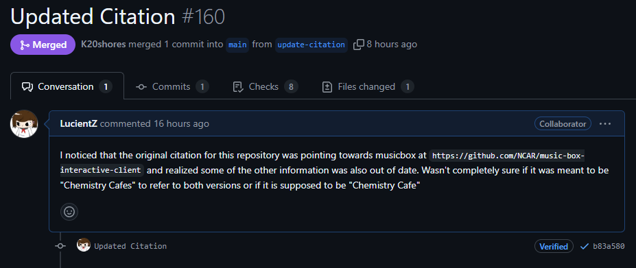

# Individual Weekly Report

**Name**: Robbie Cook

**Team**: Chem-Caf3

**Date**: 4/14/2025

## Current Status

### What did _you_ work on this past week?

| Task | Status | Time Spent | 
| ---- | ------ | ---------- |
|Increased Frontend Code Coverage|Completed|6 hours|
|Updated Citation|Completed|5 minutes|

*Include screenshots/diagrams/figures/etc. to illustrate what you did this past week.*

### What problems did you run into? What is your plan for them?

A lot of things on the frontend don't render correctly in a headless browser, meaning unit tests are weird.

The plan is to add test ids to components that aren't queryable

### What is the current overall project status from your perspective? 

We are *very* behind on the backend. I'm concerned about it actually being done or if I'm going to have to pick up some slack.

### How is your team functioning from your perspective?

Most of us are functioning pretty well, but I don't quite know how much of our goals are going to be completed in terms of the backend.

### What new ideas did you have or skills did you develop this week?

I realized that the V1 configuration has a variable that can be named multiple things for arrhenius reactions.

### Who was your most awesome team member this week and why?

My most awesome team member this week was Donato because he completed most of the accessibility implementation this week.

## Plans for Next Week

*What are you going to work on this week?*

Next week I am going to start doing user studies and fixing the issues that were brought up in our previous studies.
