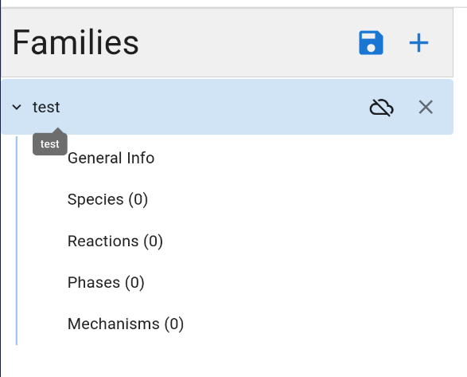

# Individual Weekly Report

**Name**: Donato Curvino

**Team**: Chem Caf3

**Date**: 4/21/25

## Current Status

### What did _you_ work on this past week?

| Task | Status | Time Spent | 
| ---- | ------ | ---------- |
| changed navigation buttons to actual links | done | 2 |
| added save button to family editor | done | 2 |

*Include screenshots/diagrams/figures/etc. to illustrate what you did this past week.*

### What problems did you run into? What is your plan for them?
I have a big exam coming up that I need to cram for. I need to focus on it for now and then make up work after.

### What is the current overall project status from your perspective? 
We are almost done, just working out some final kinks between the front and backend.

### How is your team functioning from your perspective?
Pretty good, we got better at communication.

### What new ideas did you have or skills did you develop this week?
I developed my React skills by learning how to use `useMemo` and integrating 3rd party routing libraries with React.

### Who was your most awesome team member this week and why?
Robbie yet again was good at helping me with the frontend.

## Plans for Next Week

*What are you going to work on this week?*

I need to study for my CLEP exam on Friday, but after that, I will work more on fixing and touching up the frontend.
