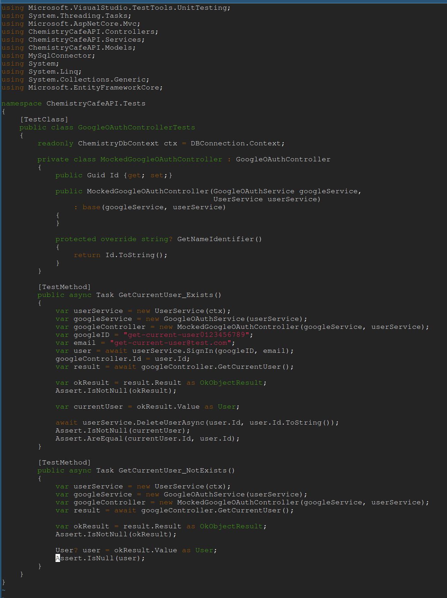
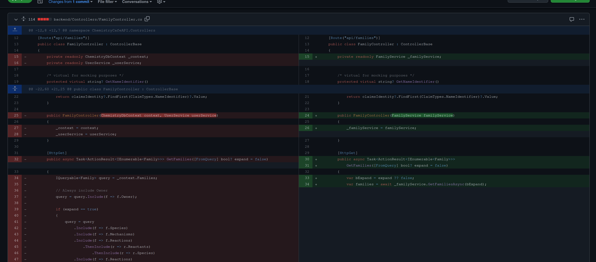
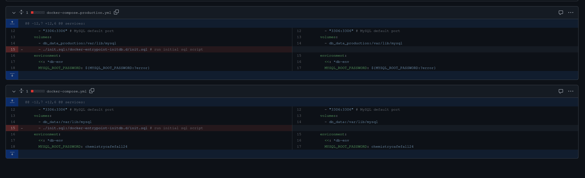
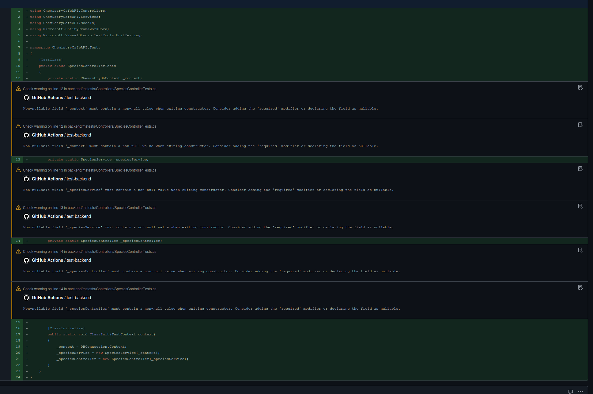

# Individual Weekly Report

**Name**:
James Fontenot

**Team**: 
Chem-Caf3

**Date**: 
April 21, 2025

## Current Status

### What did _you_ work on this past week?

| Task                                              | Status    | Time Spent | 
| --------------------------------------------------| --------- | ---------- |
|Added Google OAuth tests                           |Complete   |60 min.     |
|Refactored family service into controller          |Complete   |90 min.     |
|Made Docker no longer create unnecessary directory |Complete   |15 min.     |
|Writing species controller tests                   |In-Progress|15 min.     |

*Include screenshots/diagrams/figures/etc. to illustrate what you did this past week.*

### What problems did you run into? What is your plan for them?
I have a lot of tests to write. I will write a Controller's test class per day.

### What is the current overall project status from your perspective? 
The project is mostly done, the back-end only needs a couple tests.

### How is your team functioning from your perspective?
The team is functioning well; we have made good progress.

### What new ideas did you have or skills did you develop this week?
I learned how to modify Dockerfile.

### Who was your most awesome team member this week and why?
Robbie, because he did most of the report due this week.

## Plans for Next Week

*What are you going to work on this week?*

Added tests to new migrated species and mechanism controllers.
