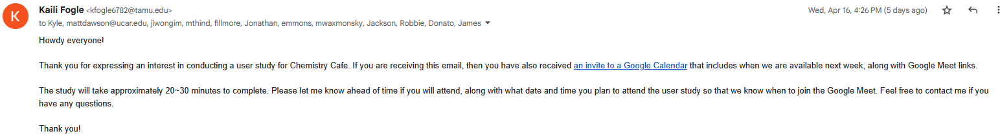

# Individual Weekly Report

**Name**: Kaili M. Fogle

**Team**: Chem Caf3

**Date**: 4.21.25

## Current Status

### What did _you_ work on this past week?

| Task | Status | Time Spent | 
| ---- | ------ | ---------- |
| Prepare for upcoming NCAR user study | Completed | 1 hour |

*Include screenshots/diagrams/figures/etc. to illustrate what you did this past week.*

Much of what I planned on doing this week we decided to not move forward with. Instead, I prioritized preparing for the user study and capstone expo, while the rest of my team completes their final set of tasks. I managed to successfully get 5 people from NCAR to agree to participate in the study.

### What problems did you run into? What is your plan for them?
Did not run into any issues.

### What is the current overall project status from your perspective? 
The project is nearing completion. From what I've been told and have seen, it is ready to go for our NCAR user study.

### How is your team functioning from your perspective?
After Robert took over some other tasks that others struggled with, we've somehow managed to get back on course. We are doing very well.

### What new ideas did you have or skills did you develop this week?
Communication skills.

### Who was your most awesome team member this week and why?
Robert was pretty cool, as usual. He also talked about Hatsune Miku which I thought was funny.

## Plans for Next Week
*What are you going to work on this week?*
I can finally make sure if the exports are actually working and automatically updated, so I will check that one last time. Other than that, I plan to devote myself to conduct the User Study with the NCAR folks on Thursday, compiling the results, and revising our expo poster and project report to reflect the results.
