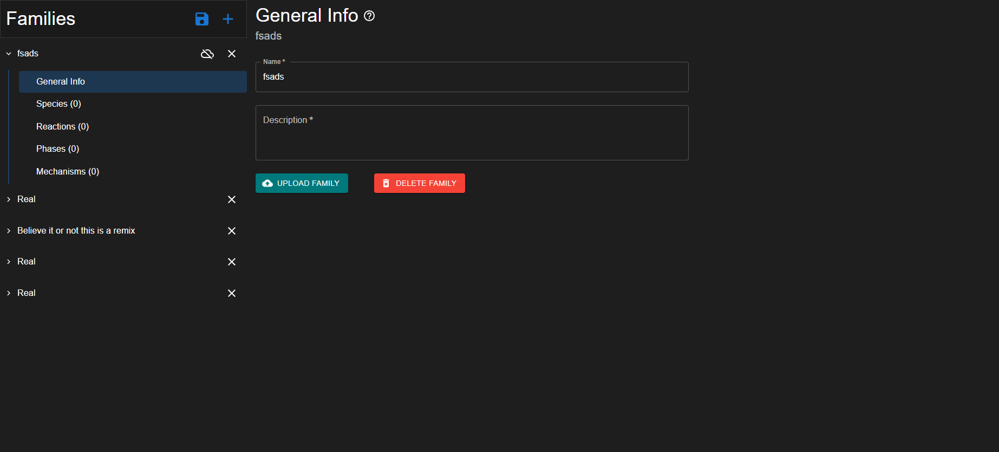

# Individual Weekly Report

**Name**: Robbie Cook

**Team**: Chem-Caf3

**Date**: 4/21/2025

## Current Status

### What did _you_ work on this past week?

| Task | Status | Time Spent | 
| ---- | ------ | ---------- |
|Implemented the rest of the backend|Completed|10 hours|
|Implemented family saving/publishing functionality|Completed|4 hours|

*Include screenshots/diagrams/figures/etc. to illustrate what you did this past week.*

### What problems did you run into? What is your plan for them?

Sometimes ids aren't UUIDs. My plan is to sanitize them with maybe a little bit of regex

### What is the current overall project status from your perspective? 

We are done with what we sought out to do. All that's left is cleanup.

### How is your team functioning from your perspective?

We're good. Everything's getting done.

### What new ideas did you have or skills did you develop this week?

I learned how entity framework works bu actually this time.

### Who was your most awesome team member this week and why?

My most awesome team member this week was Kaili because he scheduled all of the user studies and that requires social interaction which I don't have

## Plans for Next Week

*What are you going to work on this week?*

My plan is to iron out any smaller issues we have with the user interface.
