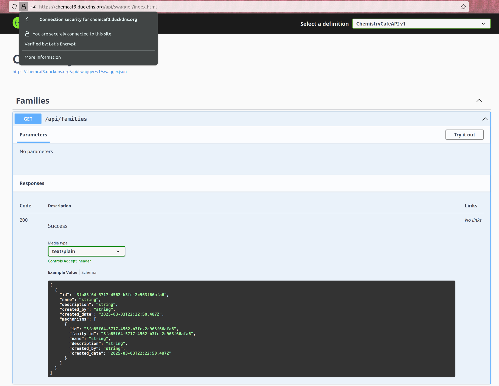

# Individual Weekly Report

**Name**: Donato Curvino

**Team**: Chem Caf3

**Date**: 3/3/25

## Current Status

### What did _you_ work on this past week?

| Task               | Status | Time Spent |
| ------------------ | ------ | ---------- |
| Staging Deployment | Done   | 6          |

*Include screenshots/diagrams/figures/etc. to illustrate what you did this past week.*

### What problems did you run into? What is your plan for them?
I ran into problems with my NGINX config, but that was just because the hard link was breaking everytime I switched branches, and I didn't realize it. 
Now, I am re-linking the config everytime I mess with Git because it needs to be in a certain location for NGINX.

### What is the current overall project status from your perspective?
We are in a good place and everyone has been consistently contributing.

### How is your team functioning from your perspective?
The team is doing better than last week because everyone is contributing.

### What new ideas did you have or skills did you develop this week?
I learned how to troubleshoot NGINX configurations by adding debug headers to the HTTP response.

### Who was your most awesome team member this week and why?
I worked with Robbie to figure out why authentication wasn't working on the deployment, so we could finally fix it.

## Plans for Next Week
*What are you going to work on this week?*

I will look at automating the deployment and possibly extending the native accesibility system.
