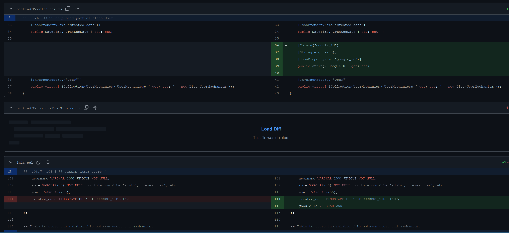
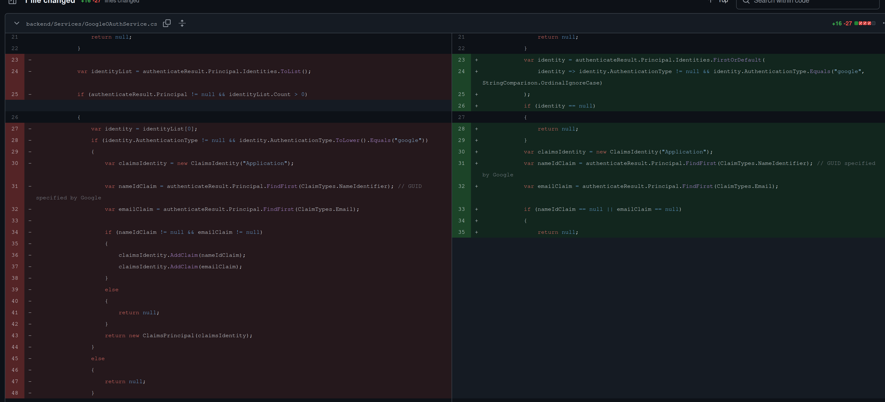
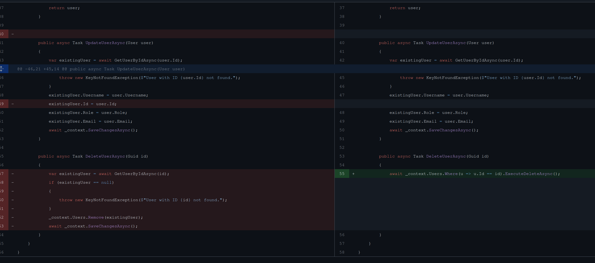
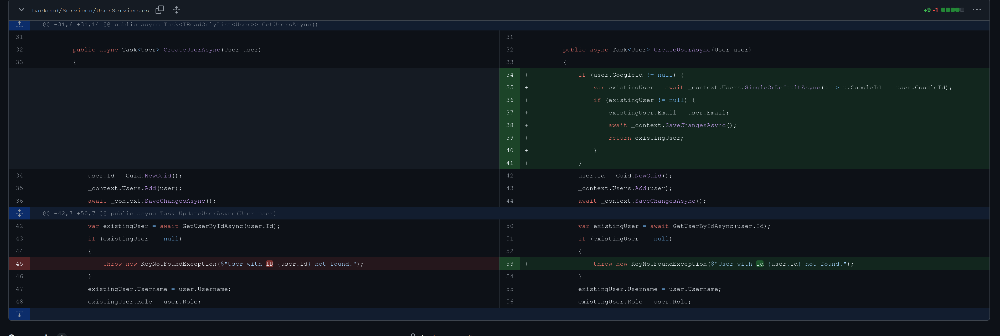

# Individual Weekly Report

**Name**:
James Fontenot

**Team**: 
Chem-Caf3

**Date**: 
March 3, 2025

## Current Status

### What did _you_ work on this past week?

| Task                                         | Status    | Time Spent | 
| -------------------------------------------- | --------- | ---------- |
|Added Google ID to User                       |Complete   |30 min.     |
|Simplified and made authentication more robust|Complete   |60 min.     |
|Simplified user deletion function             |Complete   |30 min.     |
|Google User Creation                          |In progress|30 min.     |

*Include screenshots/diagrams/figures/etc. to illustrate what you did this past week.*

### What problems did you run into? What is your plan for them?

### What is the current overall project status from your perspective? 

### How is your team functioning from your perspective?

### What new ideas did you have or skills did you develop this week?

### Who was your most awesome team member this week and why?

## Plans for Next Week

*What are you going to work on this week?*
