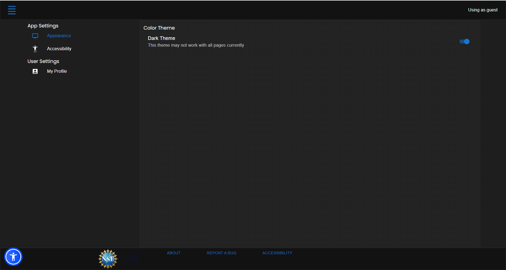

# Individual Weekly Report

**Name**: Robert Cook

**Team**: Chem-Caf3

**Date**: 3/3/2025

## Current Status

### What did *you* work on this past week?

| Task                                   | Status    | Time Spent | 
| ----                                   | ------    | ---------- |
| Application Theme Settings             | Completed | 8 hours    |
| Helped out with production auth issues | Completed | 2 hours    |

*Include screenshots/diagrams/figures/etc. to illustrate what you did this past week.*

### What problems did you run into? What is your plan for them?

The database did not migrate in producetion. We plan on automating database migrations in the future to mitigate this issue.

### What is the current overall project status from your perspective? 

The project has caught up to what I expected for the most part. There's still some things to desire, but I like where we're at.

### How is your team functioning from your perspective?

Our team is functioning better than it has ever been. I feel like we're finally fitting into our roles.

### What new ideas did you have or skills did you develop this week?

I had to actually learn Material UI and it's pretty intuitive. Everything styles pretty well and it has support for custom css in those edge cases where you need just a little bit of padding.

### Who was your most awesome team member this week and why?

My most awesome team member this weak was Donato with the frontend deployment. 

## Plans for Next Week

*What are you going to work on this week?*

This week, I plan on reimplementing the interface for editing families. It is a little unintuitive both to modify and to use with its multiple scrollbars.