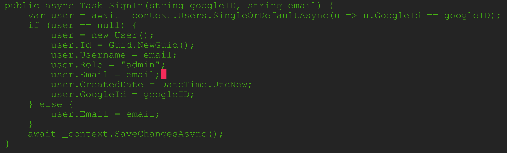

# Individual Weekly Report

**Name**:
James Fontenot

**Team**: 
Chem-Caf3

**Date**: 
March 17, 2025

## Current Status

### What did _you_ work on this past week?

| Task                                         | Status    | Time Spent | 
| -------------------------------------------- | --------- | ---------- |
|New account created on first sign in          |Complete   |60 min.     |

*Include screenshots/diagrams/figures/etc. to illustrate what you did this past week.*

### What problems did you run into? What is your plan for them?
Need faster build system; currently build takes nearly two minutes. 
Robert is planning to fix this by modifying the Dockerfile.

### What is the current overall project status from your perspective? 
Database migration is almost done; will probably have to deal with a lot of merge conflicts.

### How is your team functioning from your perspective?
It is functioning well, but I wish their was more communication between backend devs.

### What new ideas did you have or skills did you develop this week?
I learned how to write unit tests in .NET.

### Who was your most awesome team member this week and why?
Robert, because he made our build much smaller.

## Plans for Next Week

*What are you going to work on this week?*

I am going to finish back-end authentication and implement username modification.
