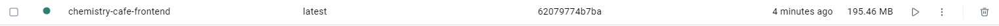
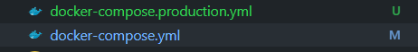

# Individual Weekly Report

**Name**: Robert Cook

**Team**: Chem-Caf3

**Date**: 3/17/2025

## Current Status

### What did _you_ work on this past week?

| Task | Status | Time Spent | 
| ---- | ------ | ---------- |
|Create production docker containers|Completed (needs review)|2 hours|

*Include screenshots/diagrams/figures/etc. to illustrate what you did this past week.*

Frontend container being 200 MB instead of 1.57 GB

### What problems did you run into? What is your plan for them?

Decoupling services is hard. The plan is to let the different services "work" independently so if a service is down, it can still 

### What is the current overall project status from your perspective? 

The overall project from my own perspective is around where we want it at the moment. 

### How is your team functioning from your perspective?

Our team is functioning well, but two of our members caught sicknesses meaning our productivity was essentially cut in half for the week. 

### What new ideas did you have or skills did you develop this week?

I learned how multi-stage docker builds work so the overall image can be lighter

### Who was your most awesome team member this week and why?

This week, my most awesome team member was James with his work on the OAuth Controller.

## Plans for Next Week

*What are you going to work on this week?*

This week I'm *actually* going to work on frontend integrations. We had a bit of a hiccup with the sickness going around, but it should be fine soon.
