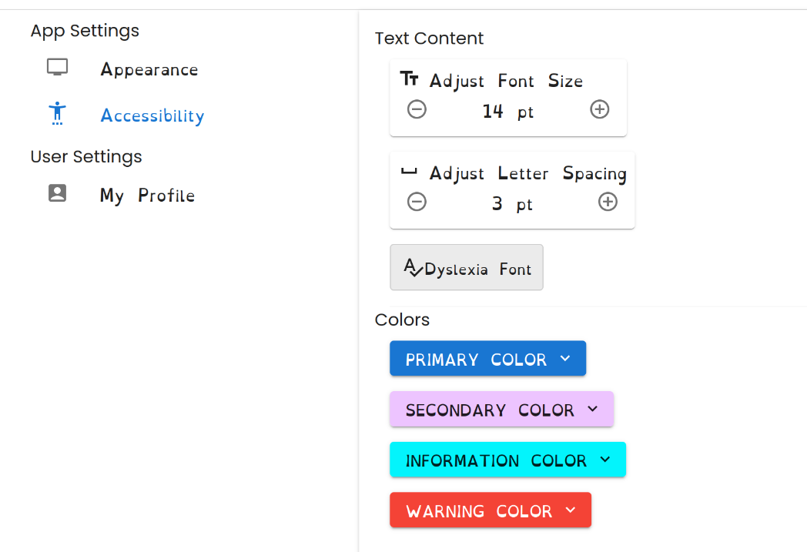

# Individual Weekly Report

**Name**: Donato Curvino

**Team**: Chem Caf3

**Date**: 3/24/25

## Current Status
I was going to work on automated deployment using GitHub Actions over the break, but I started working on accessability instead since that was a more pressing issue.

### What did _you_ work on this past week?

| Task | Status | Time Spent | 
| ---- | ------ | ---------- |
| Native accessability settings | In progress | 3 |
| Automated deployment | paused | 2 |

*Include screenshots/diagrams/figures/etc. to illustrate what you did this past week.*

### What problems did you run into? What is your plan for them?
I had gotten behind on schoolwork over the break, so I was playing catchup all last week. I finally got caught up at the end of the week, but it did not leave me much time to contribute to the project.

### What is the current overall project status from your perspective? 
The backend seems to be moving faster than the frontend. This seems due to having more people working on backend, and our frontend people also helping on the backend.

### How is your team functioning from your perspective?
We are still procrastinating and leaving things for the last minute, but we are still getting things done.

### What new ideas did you have or skills did you develop this week?
I had some wierd issues with TypeScript because I am not very familiar with it, but I was able to figure it out. Also, MaterialUI has some interesting limitations when it comes to themes, so I had to come up with some workarounds.

### Who was your most awesome team member this week and why?
Robbie helped me with both TypeScript and MaterialUI.

## Plans for Next Week
*What are you going to work on this week?*

I want to help more on the frontend and do more than just accessability because I fell like I am not doing much.

