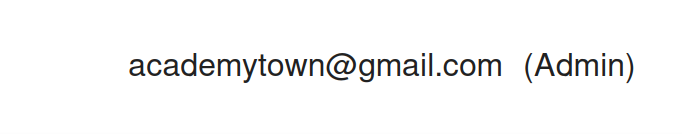

# Individual Weekly Report

**Name**:
James Fontenot

**Team**: 
Chem-Caf3

**Date**: 
March 17, 2025

## Current Status

### What did _you_ work on this past week?

| Task                                         | Status    | Time Spent | 
| -------------------------------------------- | --------- | ---------- |
|Merged and integrated sign-in                 |Complete   |30 min.     |

*Include screenshots/diagrams/figures/etc. to illustrate what you did this past week.*

### What problems did you run into? What is your plan for them?
I could not log-in on the front-end. 
I solved the problem by updating my environment file. 
I also need a new open issue to work on. 
I will ask the sponsor about new issues.

### What is the current overall project status from your perspective? 
The project is moving well; we have only three relevant open-issues.

### How is your team functioning from your perspective?
It is functioning well, but I should probably take on more work.

### What new ideas did you have or skills did you develop this week?
I learned more about environment files.

### Who was your most awesome team member this week and why?
Donato, because he finished the engineering systems section of project report.

## Plans for Next Week

*What are you going to work on this week?*

I will look into either working on a front-end issue or new back-end issue from the sponsor.
