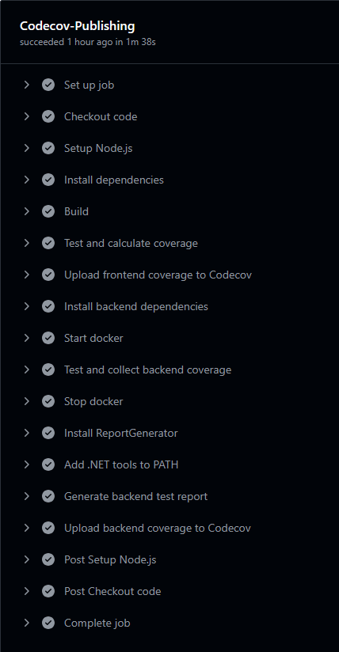

# Individual Weekly Report

**Name**: Kaili Fogle

**Team**: Chem-Caf3

**Date**: 3.24.25

## Current Status

### What did _you_ work on this past week?

| Task | Status | Time Spent | 
| ---- | ------ | ---------- |
| Generating Codecov Test Reports | Completed | 2 Hours |
| Simplifying Tests | Completed | 1 Hour |

*Include screenshots/diagrams/figures/etc. to illustrate what you did this past week.*

As you can see, the codecov test report generation now occurs when pushing to main. The generated report is also automatically uploaded to our Codecov page.

You can better view the generated test report here: https://app.codecov.io/gh/NCAR/chemistry-cafe/tree/main

I also removed a lot of unnecessary files and configurations from our project relating to testing.

### What problems did you run into? What is your plan for them?
Overall, I didn't run into any major problems, at least when it came to coding. I managed to work around my lack of internet back at my apartment so I got my deliverables completed in time for this sprint. My apartment still hasn't managed to set-up its new internet service, so I'm connected to an open network the apartment hastily set up while on a VPN. I am very paranoid so I now try to avoid handling sensitive information while using my computer at home. (I have no idea how network stuff works so I could just be paranoid for nothing.) Also my connection shuts off when there's too much traffic, so some hours I don't have access whatsoever.

### What is the current overall project status from your perspective? 
I think some of us are definitely behind on our tasks. We'll have to pick up the pace for this next sprint to meet some major goals we've had in mind for a while. I don't mind picking up parts of tasks other members are working on to speed up progress.

### How is your team functioning from your perspective?
Once again, some of us are definitely behind. Our communication also hasn't been as strong lately due to external factors and we're still starting then completing assignments and tasks when decently close to their deadlines.

### What new ideas did you have or skills did you develop this week?
This week I learned a little bit more about Github Actions, but I was mainly just applying what I learned from research and experimentation from the week prior.

### Who was your most awesome team member this week and why?
Once again I have to go with Robert. He was just talking about how he spent 18 hours on the front-end. He's definitely very dedicated and I appreciate what he does for this project as a developer and as a team member.

## Plans for Next Week

*What are you going to work on this week?*

I have no idea. For now, I'll say writing tests to improve coverage and discover then handle potential errors. However, we plan to meeet with Kyle once again tomorrow. I am most likely going to find something else to work towards then. Also, there's a possibility that when my team members complete some of their tasks, I may need to revisit the JSON and YAML configurations to resolve issues or accomodate data changes. As I stated once before, this should be an incredibly fast process.