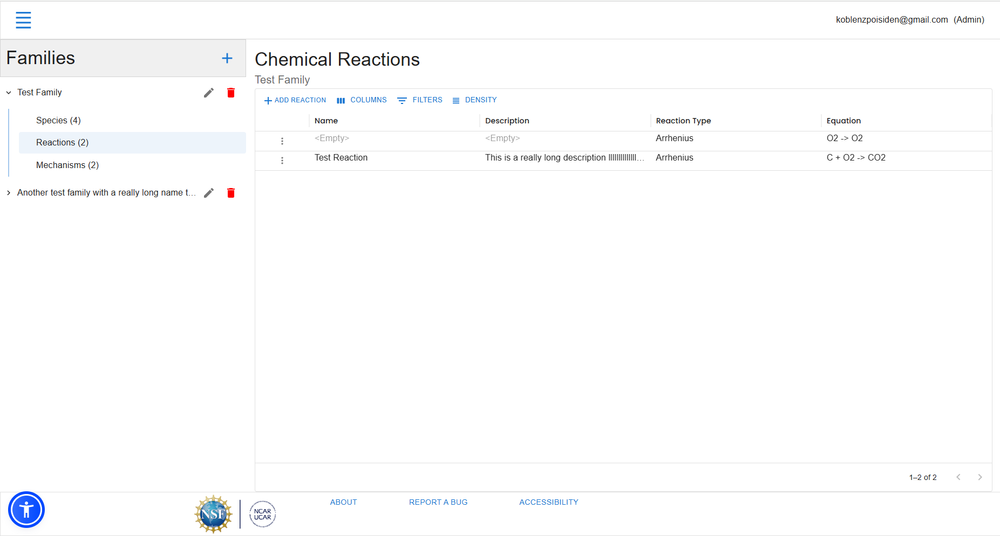
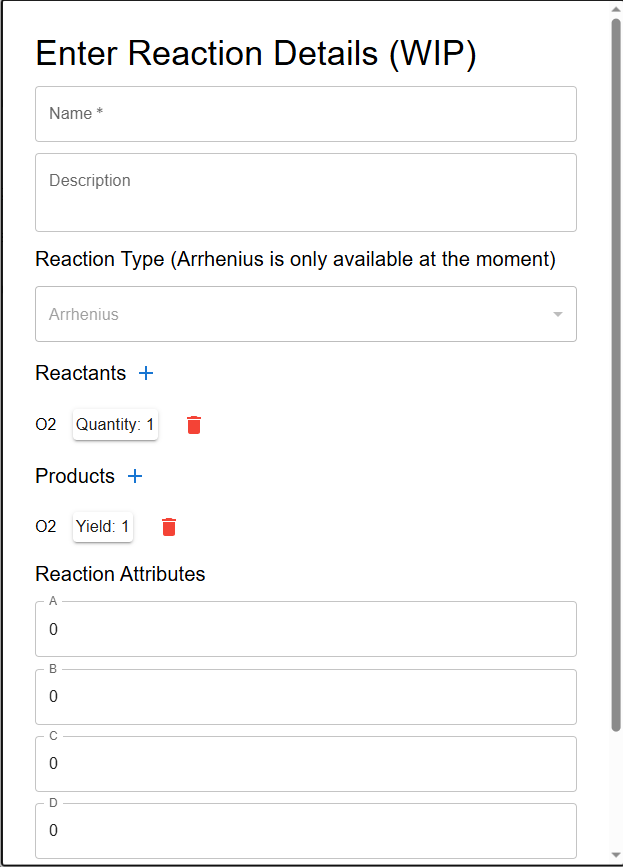

# Individual Weekly Report

**Name**: Robert Cook

**Team**: Chem-Caf3

**Date**: 3/24/2025

## Current Status

### What did _you_ work on this past week?

| Task | Status | Time Spent | 
| ---- | ------ | ---------- |
|Reimplemented Family Editor|Done|18 hours|
|Fixed docker config|Done|1 hour|
|Integrated other merge request|Done|1 hour|

*Include screenshots/diagrams/figures/etc. to illustrate what you did this past week.*

### What problems did you run into? What is your plan for them?

I had to develop a data model that did not require the backend because migrations haven't been done yet. The frontend data model is complete, so I plan on hooking it back to the backend

### What is the current overall project status from your perspective? 

In terms of actual completion, it looks pretty decent. We're on our way to finally be able to zip a configuration file and put it in musicbox or another analysis tool that is compatable with our data format

### How is your team functioning from your perspective?

Our team works very well together under time pressure, but ideally we wouldn't need that time pressure in the first place. I do appreciate that if one person works on one thing a lot, the others will pick up the slack on another part of the work (especially when it comes to classwork like our report)

### What new ideas did you have or skills did you develop this week?

I learned how to move data around in react properly, and it is not very fun. For some strange reason, one of the hardest things to do with this framework is update a list render-hook. It's especially bad if the list is inside an object.

### Who was your most awesome team member this week and why?

My most awesome team member this week was Kaili because his code-coverage branch worked first try when the pull-request came in.

## Plans for Next Week

Next week, I plan on finally hooking up the frontend to the backend and re-add the concept of mechanisms to the frontend.
