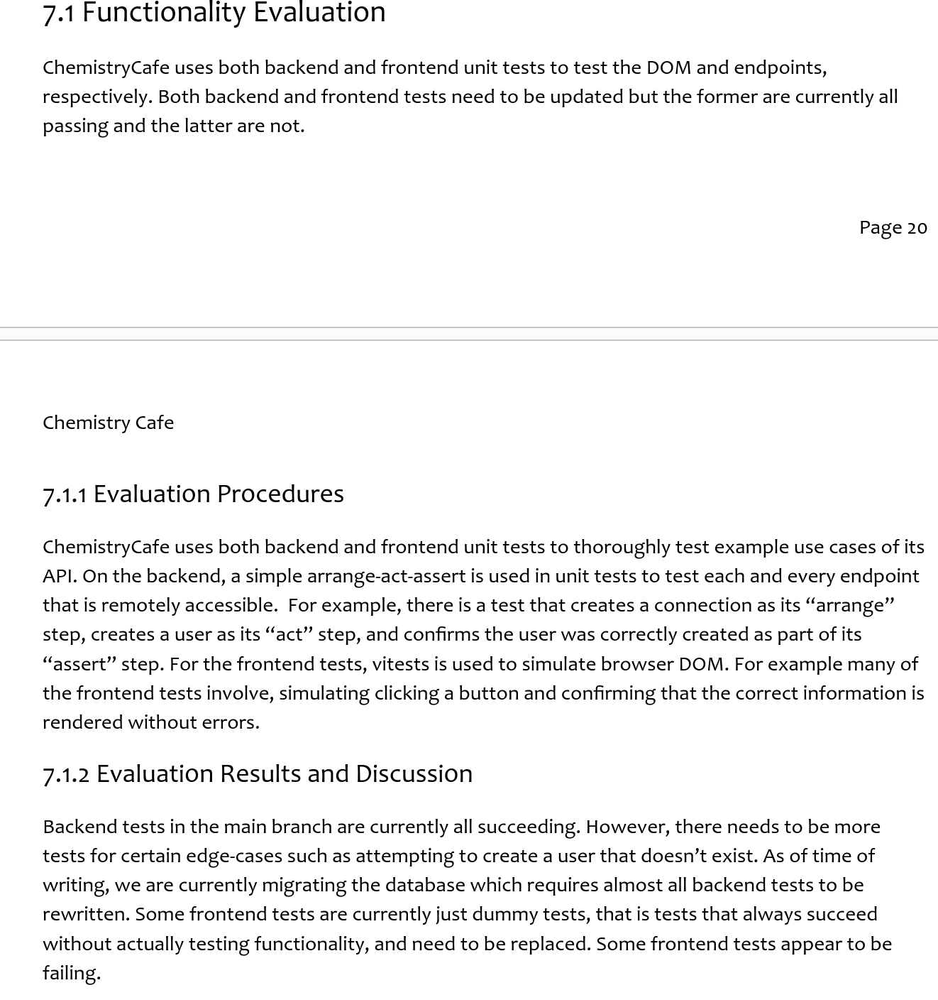

# Individual Weekly Report

**Name**:
James Fontenot

**Team**: 
Chem-Caf3

**Date**: 
March 31, 2025

## Current Status

### What did _you_ work on this past week?

| Task                                         | Status    | Time Spent | 
| -------------------------------------------- | --------- | ---------- |
|Worked on evaluation plan                     |Complete   |60 min.     |

*Include screenshots/diagrams/figures/etc. to illustrate what you did this past week.*

### What problems did you run into? What is your plan for them?
Not anything to do on project, due to delays from another team member.
Plan to start working on front-end, if progress is not made.

### What is the current overall project status from your perspective? 
The project is moving well; we have only four relevant open-issues.

### How is your team functioning from your perspective?
It is functioning well, but their needed to be a better plan for database migrations.

### What new ideas did you have or skills did you develop this week?
I learned more about the different types of testing that exists.

### Who was your most awesome team member this week and why?
Robert, because he finished the harder part of the evaluation section of project report.

## Plans for Next Week

*What are you going to work on this week?*

I will hopefully start working on new back-end tests for database migrations.
