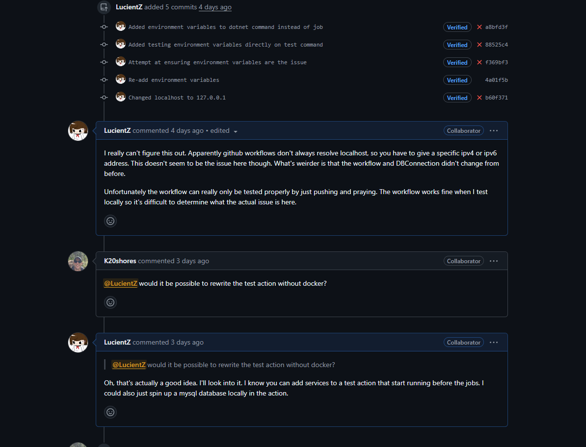

# Individual Weekly Report

**Name**: Robbie COok

**Team**: Chem-Caf3

**Date**: 3/31/2025

## Current Status

### What did _you_ work on this past week?

| Task | Status | Time Spent | 
| ---- | ------ | ---------- |
|Worked on the evaluation report|Completed|1 hour|
|Investigated CI/CD pipeline issues|In progress|2 hours|

*Include screenshots/diagrams/figures/etc. to illustrate what you did this past week.*

### What problems did you run into? What is your plan for them?

For some reason the github environment for tests cannot connect to the database. This might possibly be a linux thing because one of our linux users had a similar issue. Our plan is to fix this by the end of the week.

### What is the current overall project status from your perspective? 

We are definitely chugging along, though this week is going to be stressful in terms of development because there is a lot to catch up on.

### How is your team functioning from your perspective?

Our team is functioning kind of well, though the disappearance of Donato due to his corps responsibilities has hurt our productivity slightly.

### What new ideas did you have or skills did you develop this week?

I had a new idea of how to represent mechanisms on the front end and how the editor will be realized. In addition to this, the editor needs some fixes for usability that I realized when seeing people try to use it.

### Who was your most awesome team member this week and why?

My most awesome team member this week was Jackson because he got a lot of work done and we had a good discussion along with Kyle about what could be improved.

## Plans for Next Week

*What are you going to work on this week?*

I am going to finish the mechanism editor as well as add more API interface interactions with the backend.