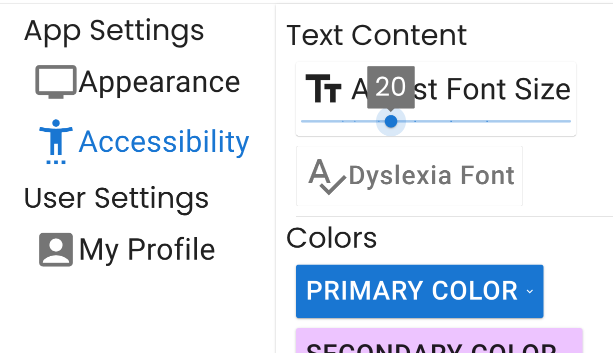

# Individual Weekly Report

**Name**: Donato Curvino

**Team**: Chem Caf3

**Date**: 4/7/25

## Current Status

### What did _you_ work on this past week?

| Task | Status | Time Spent | 
| ---- | ------ | ---------- |
| Accessability settings | In progress | 1 |

*Include screenshots/diagrams/figures/etc. to illustrate what you did this past week.*

### What problems did you run into? What is your plan for them?
I've been gone at a competition and have been really busy with Corps stuff.
Kinda can't do much about that.

### What is the current overall project status from your perspective? 
We are running into some integration errors, so we are running behind.

### How is your team functioning from your perspective?
We are pretty unresponsive in our group chats, so we could do better about commuincation.

### What new ideas did you have or skills did you develop this week?
Again, I didn't do much last week because I've been so busy with other things.

### Who was your most awesome team member this week and why?
James helped a lot  with the report.

## Plans for Next Week

*What are you going to work on this week?*

I will help finish the team link the frontend and backend.