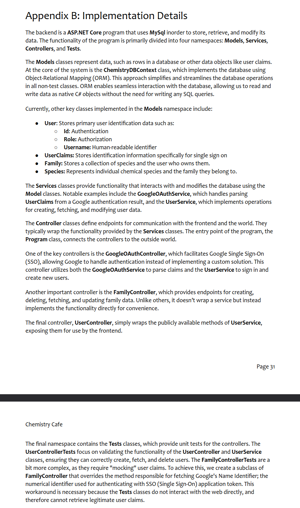

# Individual Weekly Report

**Name**:
James Fontenot

**Team**: 
Chem-Caf3

**Date**: 
April 7, 2025

## Current Status

### What did _you_ work on this past week?

| Task                                         | Status    | Time Spent | 
| -------------------------------------------- | --------- | ---------- |
|Write Backend Implementation Section          |Complete   |90 min.     |
|Write User Manual Section                     |Complete   |60 min.     |
|Write FamilyControllerTests                   |Complete   |240 min.    |
|Fix Authentication Vulnerability              |Complete   |30 min.     |

*Include screenshots/diagrams/figures/etc. to illustrate what you did this past week.*

### What problems did you run into? What is your plan for them?
Back-end migration testing could not be completed because team member had not migrated
the tested classes them. Well start writing back-end migrations myself if needed.

### What is the current overall project status from your perspective? 
The project is moving well on the front-end but poorly on the back-end.

### How is your team functioning from your perspective?
Needs more communication, specifically for the establishment of goals and deadlines.

### What new ideas did you have or skills did you develop this week?
I learned how to mock classes use virtual functions.

### Who was your most awesome team member this week and why?
Robert, because he successfully merged the back-end hours before it was due.

## Plans for Next Week

*What are you going to work on this week?*

I will work on back-end migrations.
