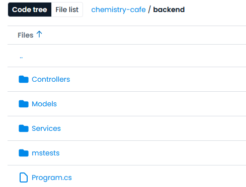

# Individual Weekly Report

**Name**: Kaili M. Fogle

**Team**: Chem-Caf3

**Date**: 04.07.25

## Current Status

### What did _you_ work on this past week?

| Task | Status | Time Spent | 
| ---- | ------ | ---------- |
| Finding frontend bugs | Complete | 3 Hours |
| Purging old, outdated code | Complete | 1 Hour |
| Fixing the codecov report to exclude migrations | Complete | 4 Hours |

*Include screenshots/diagrams/figures/etc. to illustrate what you did this past week.*

Since we spent the bulk of the week preparing for large-scale database migrations, I removed hundreds of lines of old code that was now effectively useless. In particular, a lot of the API code had to be removed, along with the tests that were then made redundant.
I also took some more time to poke at the frontend for vulnerabilities or bugs, but for the most part I couldn't find anything worrying, which is nice.
Lastly, once the migrations happened, they were included in the coverage report, which is absolutely not supposed to happen, so I fixed that. Oddly, this took a long time because I couldn't figure out that the .runsettings file was actually useless, or at the very least too inconsistent to be useful. You can see in the provided image that codecov does now in fact not include the Migrations folder. The README and workflow were updated to reflect accompanying changes.

### What problems did you run into? What is your plan for them?
I didn't run into too many issues this week, and the ones I did find I managed to solve on my own.
In terms of personal issues, I guess I've had this headache that's gone on for 4 days straight now.

### What is the current overall project status from your perspective? 
The new database migrations took a while and we're having to integrate the frontend and backend. These all require a lot of work, which we couldn't quite finish this sprint. This has put our project status in a troubling area, but overall I think we'll get everything done in time.

### How is your team functioning from your perspective?
We're definitely behind, seeing as how ideally everything should have been done by today. I think one issue our team always had was that we're a little slow. Usually we'd get away with this by working things out on weekends but this time the changes were too large. With that being said, the core functionality does actually work, so I think this setback will be manageable.

### What new ideas did you have or skills did you develop this week?
I didn't work on them personally, but I got a good refresher on migrations since 431. Aside from that, I only learned a bit more about more of the peculiarities of our application.

### Who was your most awesome team member this week and why?
Robert no diff. He's by far the most consistent and most productive.

## Plans for Next Week
*What are you going to work on this week?*
Since the plans for writing new tests fell behind schedule, I can work on that this week with Jackson. Other than that, really just preparing for capstone expo and making any final touches to the project. I'll also continue to experiment with logging in, families, settings, etc. to find any bugs or issues.
