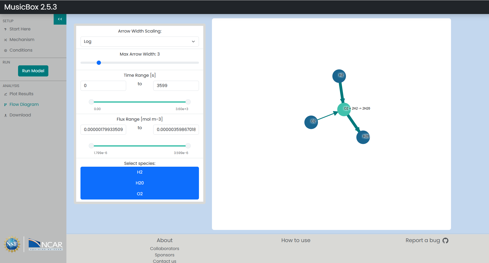
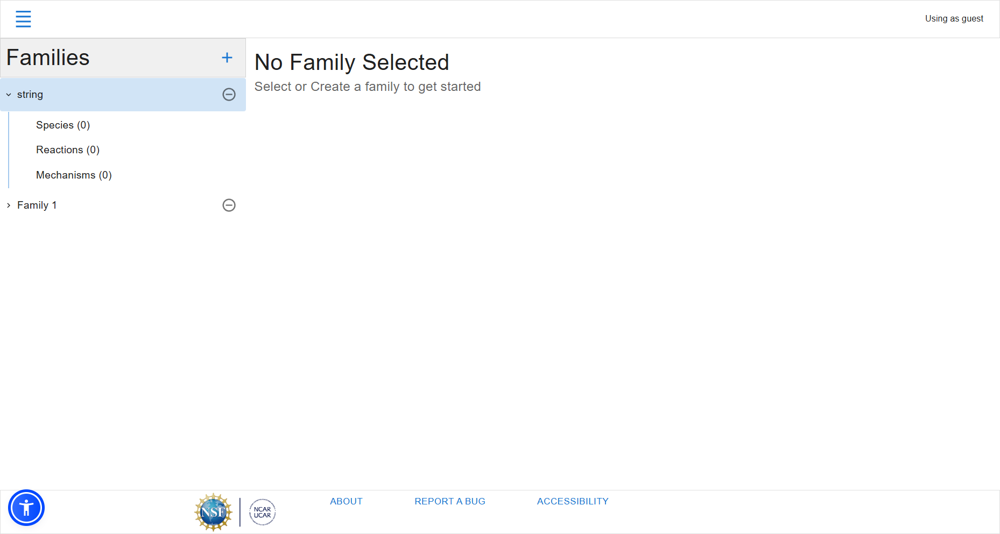

# Individual Weekly Report

**Name**: Robbie Cook

**Team**: Chem-Caf3

**Date**: 4/7/2025

## Current Status

### What did _you_ work on this past week?

| Task | Status | Time Spent | 
| ---- | ------ | ---------- |
|Frontend Interface Enhancements|Completed|10 hours|
|JSON Serialization of Mechanisms|Completed|4 hours|

*Include screenshots/diagrams/figures/etc. to illustrate what you did this past week.*

Model generated by the app running in MusicBox

### What problems did you run into? What is your plan for them?

MusicBox uses CAMP V0 and our app was meant to make CAMP V1. I managed to create V0 serialization as well and now the app supports both

### What is the current overall project status from your perspective? 

We're behind, but we can make it for sure.

### How is your team functioning from your perspective?

I'm uncertain, but in terms of work ethic as a whole we're definitely unbalanced. However, we function well when working together

### What new ideas did you have or skills did you develop this week?

I had a new idea of how to represent mechanisms on the front end and how the editor will be realized. In addition to this, the editor needs some fixes for usability that I realized when seeing people try to use it.

### Who was your most awesome team member this week and why?

My most awesome team member this week was James because he put in a lot of work in making sure the backend tests worked.

## Plans for Next Week

*What are you going to work on this week?*

I am going to add save functionality to families and hopefully that will be the majority of the work done.